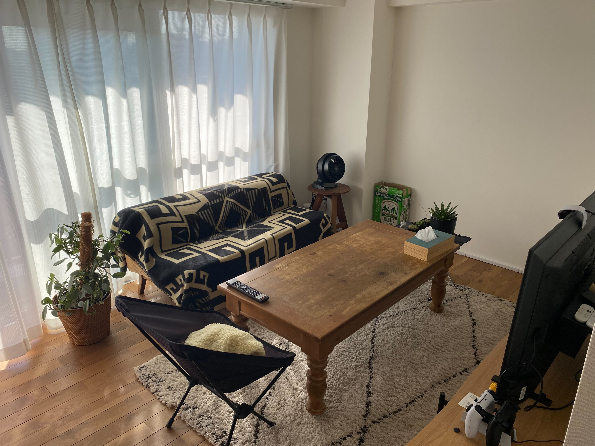

去年に引き続き、今年も振り返りを書きます。2024 年は激動の一年でした。

# 2024 年に読んだ本

## 通しで読んだやつ

今年は必要に駆られてこの辺の本を読んでました。

- [正しいものを正しくつくる プロダクトをつくるとはどういうことなのか、あるいはアジャイルのその先について](https://www.amazon.co.jp/dp/4802511191)
- [単体テストの考え方/使い方](https://www.amazon.co.jp/dp/4839981728)
- [データ指向アプリケーションデザイン ―信頼性、拡張性、保守性の高い分散システム設計の原理](https://www.amazon.co.jp/dp/4873118700)
- [アジャイルチームによる目標づくりガイドブック OKRを機能させ成果に繋げるためのアプローチ](https://www.amazon.co.jp/dp/479818473X)
- [図解入門 よくわかる 最新 Salesforceの導入と運用](https://www.amazon.co.jp/dp/4798061840/)

『正しいものを正しくつくる』はチーム内で実施した輪読会の課題図書だったこともあり、特にていねいに読んだ気がする。第三章「不確実性への適応」が僕の担当箇所だったのだけれど、しっかり準備して臨んだおかげで「広さでコミットし深さで調整する」などのキーワードを咀嚼でき、チームにも根付いた気がする。

## 必要に応じて拾い読みしたやつ

こちらも必要に駆られて買ったやつ。本当は通読したかったんですが、必要に応じてリファレンスするだけになってしまった…。

- [プロになるJava―仕事で必要なプログラミングの知識がゼロから身につく最高の指南書](https://www.amazon.co.jp/dp/4297126850)
- [分散SQLクエリエンジンTrino徹底ガイド](https://www.amazon.co.jp/dp/4798071676)
- [Tableau徹底入門](https://www.amazon.co.jp/dp/4320072014)
- [ゼロからのデータ基盤 Snowflake実践ガイド](https://www.amazon.co.jp/dp/4295602418)

『Tableau徹底入門』と『Snowflake実践ガイド』は、どちらも最速で Tableau 用語と
Snowflake 用語を抑えるのに役立つ一冊でした。

# 2024 年にやったゲーム

PlayStation を 124 時間、 Nintendo Switch を 72 時間やっていたようです。Steam
もやってたはず。

- [ファイナルファンタジーXIV](https://www.playstation.com/ja-jp/games/final-fantasy-xiv-online/)
- [The Last of Us Part II Remastered](https://www.playstation.com/ja-jp/games/the-last-of-us-part-ii-remastered/)
- [地球防衛軍6](https://www.playstation.com/ja-jp/games/earth-defense-force-6/)
- [ユニコーンオーバーロード](https://store-jp.nintendo.com/item/software/D70010000058315)
- [グノーシア](https://store-jp.nintendo.com/item/software/D70010000027791)
- [ENDER LILIES: Quietus of the Knights](https://store.steampowered.com/app/1369630/)
- [Refind Self: 性格診断ゲーム](https://store.steampowered.com/app/2514960/)
- [未解決事件は終わらせないといけないから](https://store.steampowered.com/app/2676840/)
- [Palworld / パルワールド](https://store.steampowered.com/app/1623730/)

# 2024 年買ってよかったもの

2024 年ベストバイは **家** でした。

あーだこーだ悩んだ末、カウカモ経由で中古マンションを購入しました。フルリノベ済みの
2LDK（ペット可）に住むことができ、全体的に満足しています。

借家住まいの頃と比較して月々の支払額が変わっていない点も嬉しいポイント。

築 50
年マンションならではの悩みは色々あるんですが、ヴィンテージマンション仲間が社内に多数いるので心強いです。住宅ローン控除がなかったりして辛いけど、ともに支え合って生きていきましょう。

あとは引越しに際して家具や家電をたくさん買いました。

## 家電部門

- [エジソンスマート / LED スポットライト](https://item.rakuten.co.jp/edisonsmart/esmartspotr5/)
- [Anker / Eufy RoboVac L35 Hybrid+](https://item.rakuten.co.jp/anker/t2182/)
- [ダイキン / 空気清浄機](https://www.amazon.co.jp/dp/B0DBVLX1T1)
- [富士通ゼネラル / nocria（ノクリア）W-BKシリーズ](https://www.biccamera.com/bc/item/11186714/)
- [BALMUDA / The Gohan 3合炊き電気炊飯器](https://www.amazon.co.jp/dp/B01N24RCQ7/)
- [BALMUDA / The Pot 電気ケトル](https://www.amazon.co.jp/dp/B0CWKD99QV/)
- [東芝 / REGZA Z570L シリーズ](https://www.amazon.co.jp/dp/B0B631FJJX)
- [ボルネード / サーキュレーター 52-JP](https://vornado.jp/store/products_item/52-JP)

## インテリア部門

- [Re:CENO / R.U.S おすすめセット #52](https://www.receno.com/us-kitchendining/rusreco52.php)
- [Re:CENO / 2人掛けローソファー culum](https://www.receno.com/two/culls2.php)
- [Re:CENO / ベルギー産 ウィルトン織り ラグマット ボヘム](https://www.receno.com/rag/bwrug.php#5)
- [JOURNAL STANDARD FURNITURE / PANGA STOOL](https://baycrews.jp/item/detail/js-furniture/furniture/23704960002070)
- [JOURNAL STANDARD FURNITURE / QUEST RUG](https://baycrews.jp/item/detail/js-furniture/interior/23013960001270)
- [JOURNAL STANDARD FURNITURE / PO RUG](https://baycrews.jp/item/detail/acme/interior/22013972000370)
- [ACME Furniture / BRENTWOOD MAT](https://baycrews.jp/item/detail/acme/interior/20013970002970)
- [BasShu / ウールブランケット](https://basshu.jp/collections/all-products/products/89822)
- [BasShu / THE STRIPES Duvet Cover](https://basshu.jp/collections/bedding/products/41066)

様子のおかしい量の買い物をしてしまったので頑張って働こうと思います。

# 2024 年の推し

宇多田ヒカルのライブに行ったり、 ROCK IN JAPAN FESTIVAL
でイエモンやサザンを見たりでなんだかんだ充実してた気がします。

ラッパーは多数逮捕されていたようですが、私の推しは無事でした。よかった〜。

- [ラッパー・JNKMN、愛知県警が逮捕　SNSで薬物犯罪そそのかす　ファン騒然「嘘でしょ??」「まじかよ…」 | ORICON NEWS](https://www.oricon.co.jp/news/2350013/full/)
- [「お前のこと殺したる」ラッパー・孫GONG逮捕にSNS衝撃「逮捕だと？まじかよぉ…」「何してんのよ」 | ORICON NEWS](https://www.oricon.co.jp/news/2357075/full/)
- [人気ラッパー・RYKEYDADDYDIRTY＆“Z李”運営の男を逮捕　SNSは驚きの声「何してんだ…」「今になって」 | ORICON NEWS](https://www.oricon.co.jp/news/2357620/)

ピーナッツくんのライブチケットに今のところ全落ちしているので、来年こそは行きたいですね。

それでは良いお年を！
